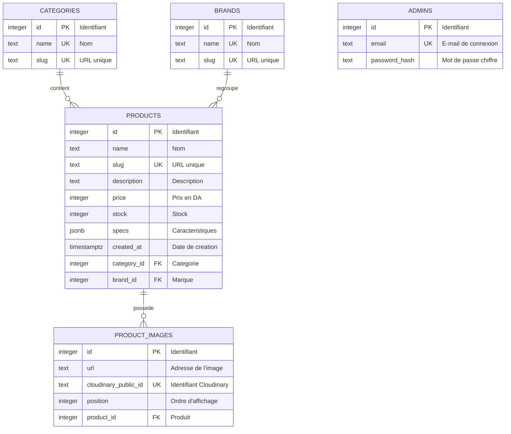

# T06 — Cahier des charges et schéma de la base

Salah · 9 octobre 2026

## 1. Contexte et objectifs

Une marque tech veut présenter ses produits sur le web pour attirer plus de clients, et les gérer elle-même sans développeur. Dans ce document, « la marque » est le client, et « le prestataire » désigne Salah et Samad.

Le site est une vitrine : les visiteurs parcourent, cherchent et filtrent les produits, puis contactent la marque par téléphone, WhatsApp ou e-mail. Aucun paiement n'a lieu en ligne.

| Objectif | Indicateur de réussite |
| --- | --- |
| Présenter les produits de la marque en ligne | 20 à 30 produits réels publiés à la mise en ligne (T37) |
| Retrouver vite un produit | Depuis l'accueil, une fiche produit s'atteint en 3 actions au plus (recherche ou filtre, puis clic) |
| Laisser la marque gérer son catalogue seule | Un administrateur ajoute un produit avec ses photos en moins de 5 minutes, sans aide |
| Être lisible partout | Toutes les pages sont utilisables sur un écran de 360 px de large comme sur ordinateur |
| Livrer à temps, sans frais d'hébergement | Site en ligne à la fin de la semaine 8 du plan (10 avec la marge de 20 %), hébergement gratuit |

Les seuils « 3 actions » et « 5 minutes » sont des valeurs proposées, à confirmer avec la marque.

## 2. Périmètre

La première version (MVP) couvre la recherche et le filtrage côté client, et la gestion des articles, des catégories et des marques côté admin.

**Inclus**

- Site client : accueil, catalogue avec recherche, filtres, tri et pagination, fiche produit.
- Espace admin : connexion, gestion des produits, des catégories et des marques, envoi de photos.
- Mise en ligne, avec un jeu de 20 à 30 produits réels.

**Exclu pour l'instant**

- Panier, demande de devis et paiement en ligne.
- Comptes clients et listes de souhaits.
- Avis, comparateur de produits, import de produits par fichier CSV, statistiques de visites, version multilingue.
- Plusieurs comptes administrateurs : un seul compte, partagé par la marque.

## 3. Utilisateurs et rôles

Le site a deux types d'utilisateurs : le visiteur, anonyme, et l'administrateur, qui se connecte.

| Rôle | Qui | Ce qu'il peut faire | Accès |
| --- | --- | --- | --- |
| Visiteur | Tout internaute, sans compte | Parcourir le catalogue, chercher, filtrer, voir une fiche produit, contacter la marque | Libre, sans connexion |
| Administrateur | Une personne de la marque (un seul compte au départ) | Tout ce que fait le visiteur, plus ajouter, modifier et supprimer produits, catégories et marques, et envoyer des photos | E-mail et mot de passe |

Les visiteurs ne laissent aucune donnée personnelle : le site n'a ni compte client ni formulaire.

## 4. Besoins fonctionnels

Le site doit répondre à 10 besoins côté client et 9 côté admin ; chacun a un critère de réussite vérifiable à la recette (T32).

### Espace client

| ID | Besoin | Critère de réussite | Tâches |
| --- | --- | --- | --- |
| C1 | Voir l'accueil : catégories et derniers produits | L'accueil affiche toutes les catégories et les derniers produits ajoutés | T18 |
| C2 | Parcourir le catalogue page par page | La liste affiche 12 produits par page, avec des liens vers les autres pages | T14, T19 |
| C3 | Chercher par mot-clé | Chercher « casque » ne renvoie que des produits dont le nom ou la description contient « casque », en majuscules ou en minuscules | T15, T19 |
| C4 | Filtrer par catégorie, marque, fourchette de prix et disponibilité | Chaque filtre réduit la liste, plusieurs filtres se combinent, et un message clair s'affiche s'il n'y a aucun résultat | T15, T19 |
| C5 | Trier la liste | Le tri propose : plus récents, prix croissant, prix décroissant, nom de A à Z | T15, T19 |
| C6 | Partager une recherche | L'adresse de la page contient la recherche, les filtres, le tri et la page : ouverte ailleurs, elle affiche la même liste | T19 |
| C7 | Voir la fiche d'un produit | La fiche affiche les photos (galerie), la description, les caractéristiques, le prix et « en stock » ou « rupture de stock » | T16 |
| C8 | Contacter la marque | Un bouton de la fiche propose le téléphone, WhatsApp et l'e-mail de la marque | T16 |
| C9 | Utiliser le site sur téléphone | Toutes les pages restent utilisables sur 360 px de large, sans défilement horizontal | T20 |
| C10 | Comprendre ce qui se passe | Une liste vide, une erreur ou une page introuvable (404) affichent un message compréhensible | T20, T30 |

### Espace admin

| ID | Besoin | Critère de réussite | Tâches |
| --- | --- | --- | --- |
| A1 | Se connecter, rester connecté, se déconnecter | Des identifiants justes ouvrent l'espace admin ; des identifiants faux sont refusés avec un message d'erreur | T21, T25 |
| A2 | Protéger l'espace admin | Sans connexion, une adresse admin renvoie à la page de connexion et l'API refuse toute modification | T21, T25 |
| A3 | Lister et chercher les produits | La liste affiche tous les produits et se filtre par mot-clé | T26 |
| A4 | Ajouter un produit | Une fois saisis nom, prix, description, caractéristiques, stock, catégorie, marque et photos, le produit apparaît aussitôt dans le catalogue client | T22, T24, T27 |
| A5 | Modifier un produit | Après enregistrement, la fiche client affiche les nouvelles valeurs et les photos ajoutées ou retirées | T22, T24, T27 |
| A6 | Supprimer un produit | Une confirmation est demandée ; le produit et ses photos disparaissent du catalogue | T22, T26 |
| A7 | Gérer les catégories | On ajoute et on supprime des catégories (renommer est facultatif) ; une nouvelle catégorie apparaît dans le formulaire produit et dans le filtre client | T23, T28 |
| A8 | Gérer les marques | Même comportement que pour les catégories | T23, T28 |
| A9 | Envoyer des photos | Seuls les formats JPEG, PNG et WebP jusqu'à 5 Mo sont acceptés ; une photo refusée affiche la raison ; la première photo est la photo principale | T24 |

Valeurs proposées, à confirmer : 12 produits par page, 360 px de large, 5 Mo par photo.

## 5. Règles de gestion

Dix règles encadrent les données : la base de données applique celles qui touchent aux liens et à l'unicité, et l'API vérifie les autres.

| ID | Règle | Appliquée par |
| --- | --- | --- |
| RG1 | Un produit appartient à une seule catégorie et à une seule marque. | Base de données |
| RG2 | Une catégorie ou une marque qui contient encore des produits ne peut pas être supprimée : il faut d'abord déplacer ou supprimer ces produits (règle à confirmer en T23). | Base de données et API |
| RG3 | Supprimer un produit supprime aussi ses photos, en base et chez Cloudinary. | Base de données et API |
| RG4 | Le nom d'une catégorie ou d'une marque est unique. | Base de données |
| RG5 | Chaque produit, catégorie et marque a un « slug » unique, fabriqué à partir de son nom et utilisé dans les adresses des pages. | Base de données et API |
| RG6 | Le prix est un entier supérieur ou égal à 0, en DA ; le stock est un entier supérieur ou égal à 0. | API |
| RG7 | Un produit est « disponible » si son stock est supérieur à 0 ; sinon sa fiche indique « rupture de stock » et le filtre de disponibilité l'écarte. | API et interface |
| RG8 | Un produit a plusieurs photos ; celle de position 0 est la photo principale. | Base de données |
| RG9 | Un produit ajouté est visible tout de suite : la première version n'a pas de brouillon. | API et interface |
| RG10 | Un mot de passe n'est jamais enregistré en clair, seulement son hachage ; le compte admin est créé par le prestataire, jamais par une inscription en ligne. | API |

## 6. Besoins non fonctionnels

Le site doit se charger vite, rester sûr et s'utiliser aussi bien sur téléphone que sur ordinateur.

| ID | Domaine | Exigence | Vérification |
| --- | --- | --- | --- |
| NF1 | Performance | Une page du catalogue s'affiche en moins de 3 secondes sur une connexion mobile moyenne, une fois l'API réveillée | Mesure dans le navigateur (Lighthouse), T32 |
| NF2 | Compatibilité | Pages utilisables dès 360 px de large, dans les versions récentes de Chrome, Edge, Firefox et Safari | Test sur téléphone et en mode mobile du navigateur, T32 |
| NF3 | Sécurité | Mots de passe hachés (bcrypt), connexion par jeton JWT, routes admin protégées, données validées par l'API, secrets hors de GitHub (fichier .env), HTTPS en ligne, limite de requêtes sur la connexion | Liste de contrôle T29 ; tentative d'accès admin sans jeton |
| NF4 | Référencement | Titre et description propres à chaque page, adresses lisibles (slug), images allégées, sitemap.xml soumis à Google Search Console | T31, puis après la mise en ligne |
| NF5 | Accessibilité de base | Texte alternatif sur les images, étiquette sur chaque champ de formulaire, contrastes lisibles, utilisation au clavier | Contrôle manuel, T32 |
| NF6 | Langue | Interface en français, une seule langue au départ | À confirmer (section 8) |
| NF7 | Volume | Conçu pour quelques centaines de produits ; 20 à 30 au départ | 30 produits d'essai (T13), puis les vrais produits (T37) |
| NF8 | Maintenabilité | Code sur GitHub, une branche par tâche, relecture croisée, README, fichier .env.example, variables d'environnement documentées | Revue en T38 |
| NF9 | Sauvegarde | Une sauvegarde manuelle de la base est essayée avant la mise en ligne | T33 |

Seuils proposés, à confirmer : 3 secondes, 360 px, quelques centaines de produits.

## 7. Contraintes et livrables

Le projet doit tenir en 8 à 10 semaines, avec deux développeurs et un hébergement gratuit.

| Domaine | Contrainte |
| --- | --- |
| Équipe | Deux personnes, Salah et Samad, environ 36 jours de 4 h chacun, soit 72,5 jours de travail à deux |
| Délai | 8 semaines à 4 h par jour chacun, 10 avec une marge de 20 % pour les imprévus |
| Technique | React, Vite, Tailwind CSS et React Router ; Node.js et Express ; PostgreSQL avec Prisma ; JWT et bcrypt ; Cloudinary pour les photos |
| Hébergement | Parcours A du plan de projet, gratuit et sans moyen de paiement : [Firebase Hosting](https://firebase.google.com/pricing), [Render](https://render.com/docs/free), [Neon](https://neon.com/pricing) et [Cloudinary](https://cloudinary.com/pricing) (offres consultées le 7 octobre 2026) |
| Limite de l'hébergement gratuit | L'API s'endort après 15 minutes sans visite et met environ 1 minute à se réveiller ; Render déconseille cette offre pour un site en production |
| Budget | Aucun frais d'hébergement pendant l'apprentissage et la démo ; l'achat éventuel d'un nom de domaine se décide en T36 |

**Livrables**

- Le site en ligne, espace client et espace admin, à une adresse web.
- Le code source sur GitHub (frontend et backend), avec un README.
- La base de données en ligne, remplie de 20 à 30 produits réels saisis depuis l'admin (T37).
- Un compte administrateur remis à la marque.
- Une démonstration de l'admin et un bilan du projet (T38).

## 8. Points à confirmer avec le client

Dix points restent à confirmer avec la marque ; chacun a une hypothèse de travail, utilisée dans tout ce document.

| Question | Hypothèse de travail 
| --- | --- 
| Logo, couleurs et nom de la marque : qui les fournit ? | La marque fournit le logo et les couleurs ; sinon un style sobre sera proposé 
| Langue de l'interface : français seulement ? | Français seulement 
| Monnaie des prix : dinars algériens (DA) ? | Prix en DA, entiers, sans centimes 
| Coordonnées de contact : téléphone, WhatsApp, e-mail ? | Les trois, fournis par la marque et affichés sur chaque fiche 
| Qui fournit les 20 à 30 produits, leurs photos et leurs descriptions ? | La marque, avant la tâche T37 
| Un produit peut-il avoir plusieurs catégories ? | Non, une seule catégorie par produit 
| Caractéristiques techniques : libres ou fixes par catégorie ? | Libres : une liste « nom : valeur » par produit 
| Faut-il masquer un produit sans le supprimer (brouillon) ? | Non : un produit ajouté est visible tout de suite 
| Hébergement gratuit ou payant ? Qui achète et renouvelle le nom de domaine ? | Gratuit pendant l'apprentissage ; domaine à la charge de la marque, acheté en T36 
| Après la mise en ligne : corrections, maintenance, propriété du code ? | Aucune hypothèse : à fixer par écrit avant de commencer 

## 9. Schéma de la base

La base compte **5 tables** et **24 colonnes**. Trois relations « un à plusieurs » relient quatre des cinq tables ; la table `admins` reste seule, sans lien avec les autres, car elle ne sert qu'à la connexion.

&#91;embedded content: schéma de la base · 5 tables, 3 relations\]

Products est reliée à categories, à brands et à product\_images ; admins reste seule.

### Comment lire le schéma

- `PK` : clé primaire, l'identifiant de la ligne.
- `FK` : clé étrangère, le lien vers une autre table.
- `UK` : valeur unique.
- `1` : côté « un » de la relation, et `n` : côté « plusieurs ».

### Les 5 tables

| Table | Colonnes |
| --- | --- |
| `categories` | id (PK), name (UK), slug (UK) |
| `brands` | id (PK), name (UK), slug (UK) |
| `products` | id (PK), name, slug (UK), description, price, stock, specs (jsonb), created\_at, category\_id (FK), brand\_id (FK) |
| `product_images` | id (PK), url, cloudinary\_public\_id (UK), position, product\_id (FK) |
| `admins` | id (PK), email (UK), password\_hash |

### Les 3 relations

| Relation | Ce que ça veut dire | Suppression |
| --- | --- | --- |
| `categories` → `products` | Une catégorie a plusieurs produits ; un produit a une seule catégorie | Refusée tant qu'il reste des produits (RESTRICT) |
| `brands` → `products` | Une marque a plusieurs produits ; un produit a une seule marque | Refusée tant qu'il reste des produits (RESTRICT) |
| `products` → `product_images` | Un produit a plusieurs photos ; une photo appartient à un seul produit | Les photos sont supprimées avec le produit (CASCADE) |
|  |  |  |

## 10. Dictionnaire des tables

La base compte cinq tables et 24 colonnes, nommées en anglais, en minuscules, avec des tirets bas entre les mots.

Correspondance avec le plan : nom = name, prix = price, caractéristiques = specs, date de création = created\_at, adresse de la photo = url, mot de passe haché = password\_hash. Types PostgreSQL utilisés : integer (entier), text (texte), jsonb (objet JSON) et timestamptz (date et heure avec fuseau horaire). RG1 à RG10 sont les règles de la section 5.

### categories

Une catégorie regroupe plusieurs produits.

| Colonne | Type | Contraintes | Rôle |
| --- | --- | --- | --- |
| id | integer | clé primaire, numérotée automatiquement | Identifiant interne |
| name | text | obligatoire, unique (RG4) | Nom affiché sur l'accueil et dans les filtres |
| slug | text | obligatoire, unique (RG5) | Version du nom pour l'adresse de la page : minuscules, sans accents, tirets |

### brands

Une marque regroupe plusieurs produits.

| Colonne | Type | Contraintes | Rôle |
| --- | --- | --- | --- |
| id | integer | clé primaire, numérotée automatiquement | Identifiant interne |
| name | text | obligatoire, unique (RG4) | Nom affiché sur les fiches et dans les filtres |
| slug | text | obligatoire, unique (RG5) | Version du nom pour l'adresse de la page : minuscules, sans accents, tirets |

### products

Table centrale : chaque produit pointe vers une catégorie et une marque.

| Colonne | Type | Contraintes | Rôle |
| --- | --- | --- | --- |
| id | integer | clé primaire, numérotée automatiquement | Identifiant interne |
| name | text | obligatoire | Nom affiché sur la carte et sur la fiche ; cherché par le mot-clé (C3) |
| slug | text | obligatoire, unique (RG5) | Version du nom pour l'adresse de la fiche |
| description | text | facultative | Présentation du produit sur la fiche ; cherchée par le mot-clé (C3) |
| price | integer | obligatoire ; supérieur ou égal à 0, vérifié par l'API (RG6) | Prix en DA, sans centimes (à confirmer, section 8) |
| stock | integer | obligatoire ; supérieur ou égal à 0, vérifié par l'API (RG6) | Quantité en stock ; le produit est disponible si elle dépasse 0 (RG7) |
| specs | jsonb | obligatoire, {} par défaut | Caractéristiques libres sous forme « nom : valeur », par exemple {"Écran": "6,5 pouces"} |
| created\_at | timestamptz | obligatoire, remplie à l'ajout | Date d'ajout ; sert au tri « plus récents » et aux derniers produits de l'accueil (C1, C5) |
| category\_id | integer | obligatoire, clé étrangère vers categories.id (RG1, RG2) | Catégorie du produit |
| brand\_id | integer | obligatoire, clé étrangère vers brands.id (RG1, RG2) | Marque du produit |

### product\_images

Une ligne par photo ; les fichiers eux-mêmes restent chez Cloudinary.

| Colonne | Type | Contraintes | Rôle |
| --- | --- | --- | --- |
| id | integer | clé primaire, numérotée automatiquement | Identifiant interne |
| url | text | obligatoire | Adresse de la photo chez Cloudinary |
| cloudinary\_public\_id | text | obligatoire, unique | Identifiant de la photo chez Cloudinary ; sert à la supprimer là-bas (RG3) |
| position | integer | obligatoire | Ordre dans la galerie ; 0 = photo principale (RG8) |
| product\_id | integer | obligatoire, clé étrangère vers products.id, suppression en cascade (RG3) | Produit auquel appartient la photo |

### admins

Table isolée, sans lien avec les autres : elle ne sert qu'à la connexion, avec un seul compte au départ.

| Colonne | Type | Contraintes | Rôle |
| --- | --- | --- | --- |
| id | integer | clé primaire, numérotée automatiquement | Identifiant interne |
| email | text | obligatoire, unique | Identifiant de connexion |
| password\_hash | text | obligatoire | Hachage bcrypt du mot de passe, jamais le mot de passe lui-même (RG10) |

## 11. Relations et règles d'intégrité

Trois relations « un à plusieurs » relient quatre des cinq tables ; admins reste seule.

| Relation | Lecture | Clé étrangère | Suppression du côté « un » | Règles |
| --- | --- | --- | --- | --- |
| categories vers products | Une catégorie contient plusieurs produits ; un produit a une seule catégorie | products.category\_id | Refusée tant qu'il reste des produits (RESTRICT) | RG1, RG2 |
| brands vers products | Une marque regroupe plusieurs produits ; un produit a une seule marque | products.brand\_id | Refusée tant qu'il reste des produits (RESTRICT) | RG1, RG2 |
| products vers product\_images | Un produit a plusieurs photos ; une photo appartient à un seul produit | product\_images.product\_id | Les photos sont supprimées avec le produit (CASCADE) | RG3, RG8 |

La suppression en cascade n'efface que des lignes de la base. Pour supprimer aussi les fichiers chez Cloudinary, l'API lit les cloudinary\_public\_id avant de supprimer le produit (RG3, T22).

**Ce que la base ne fait pas seule**

- price et stock : la base accepte tout entier, l'API refuse les valeurs négatives (RG6, T22).
- Position des photos : l'API renumérote 0, 1, 2… à chaque ajout ou retrait, pour qu'une seule photo soit en position 0 (RG8, T24).
- Forme de specs : la base accepte tout objet JSON, l'API vérifie les paires « nom : valeur » (T22).
- Produit sans photo : la base l'accepte ; exiger au moins une photo reste à décider en T22.
- Disponibilité : aucune colonne, elle se calcule avec stock > 0 (RG7).

**Index**

PostgreSQL crée seul un index pour chaque clé primaire et chaque contrainte d'unicité, mais pas pour les clés étrangères. On déclare donc un index sur products.category\_id, products.brand\_id et product\_images.product\_id (T10). Ils servent aux filtres et à la galerie de photos (T15, T16). Aucun autre index au départ : quelques centaines de produits (NF7) se parcourent vite.

## Résumé en arabe

المخطط فيه 5 جداول: `categories` و `brands` و `products` و `product_images` و `admins`. فيه 3 علاقات «واحد إلى متعدد»: الفئة والعلامة كل واحدة عندها بزاف منتجات، والمنتج عنده بزاف صور. جدول `admins` وحده بلا علاقة. المخطط راهو في **القسم 9**.
